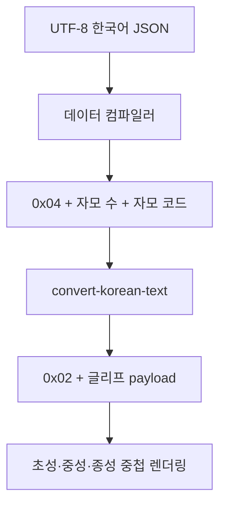

<p align="center">
  
</p>

# Jak and Daxter: The Precursor Legacy — Korean Localization

This is a personal fork of [OpenGOAL](https://github.com/open-goal/jak-project) that adds Korean UI text, subtitles, and composited Hangul rendering to **Jak 1**.


---

### 프로젝트 소개

이 저장소는 OpenGOAL의 Jak 1 PC 포트를 기반으로 다음 기능을 추가한 개인용 한글화 fork입니다.

- 게임 메뉴, 설정, 미션, 지역명 등 UI 텍스트 한국어 번역
- 컷신 자막, 힌트 자막, 화자명 한국어 번역
- Jak 1 폰트 아틀라스에 한글 자모 글리프 추가
- 초성·중성·종성을 겹쳐 그리는 조합형 한글 렌더링
- 한국어 텍스트·자막 뱅크 컴파일 및 언어 ID 17 등록
- 한글 폰트 생성, 디스크 검증, 에셋 추출, 컴파일을 위한 Windows 도구

### 법적 요구 사항

OpenGOAL과 이 fork는 원본 게임 파일을 제공하지 않습니다. 다음 항목이 필요합니다.

- 합법적으로 구매한 Jak and Daxter PS2 디스크
- 직접 추출한 디스크 이미지 또는 파일
- Windows x64 개발 환경

원본 ISO는 빌드 과정에서 수정되지 않습니다. `iso_data/`, `decompiler_out/`, `out/`과 로컬 개발 도구는 Git에 포함되지 않습니다.

### 빠른 시작: 빌드하고 플레이하기

#### 1. 저장소 복제

```powershell
git clone https://github.com/minjjKang/jak-project--jak1-kor-fork.git
cd jak-project--jak1-kor-fork
```

#### 2. 개발 환경 준비

먼저 [OpenGOAL Windows 개발 환경 문서](https://github.com/open-goal/jak-project/blob/master/docs/setup/system/windows.md)를 참고하여 다음 도구를 준비합니다.

- Visual Studio 2022 Build Tools와 C++ 워크로드
- Python 3
- CMake와 Ninja
- NASM
- Task

이 fork의 보조 스크립트는 `tools/jak1_korean_compiler/.venv`의 Python 환경을 사용합니다.

```powershell
py -3 -m venv .\tools\jak1_korean_compiler\.venv
.\tools\jak1_korean_compiler\.venv\Scripts\python.exe -m pip install -r .\tools\jak1_korean_compiler\requirements-dev.txt
```

현재 `dev-env.ps1`은 프로젝트 내부의 `.tools/vs-buildtools`를 우선 사용합니다. 해당 위치를 사용하지 않는 환경에서는 스크립트를 자신의 MSVC 설치 경로에 맞게 조정하거나 OpenGOAL의 표준 Task 명령을 사용해야 합니다.

환경을 확인합니다.

```powershell
.\tools\jak1_korean_compiler\dev.ps1 doctor
```

#### 3. 한국판 디스크 준비

직접 소유한 ISO를 `iso_data/jak1`에 놓고 파일을 추출합니다. 다음 명령은 기존 파일을 덮어쓰지 않습니다.

```powershell
New-Item -ItemType Directory -Force .\iso_data\jak1
Copy-Item 'D:\path\to\jak1-korean.iso' '.\iso_data\jak1\jak1-korean.iso'
.\tools\jak1_korean_compiler\.venv\Scripts\python.exe .\tools\jak1_korean_compiler\extract-iso.py .\iso_data\jak1\jak1-korean.iso .\iso_data\jak1
.\tools\jak1_korean_compiler\.venv\Scripts\python.exe .\tools\jak1_korean_compiler\verify-jak1-disc.py
```

#### 4. C++ 도구 빌드

```powershell
.\tools\jak1_korean_compiler\dev.ps1 configure
.\tools\jak1_korean_compiler\dev.ps1 build
```

`build`는 `gk.exe`, `goalc.exe`, `extractor.exe`, `goalc-test.exe`를 빌드하고 한글 컴파일 도구의 `bin/` 디렉터리에 필요한 실행 파일을 복사합니다.

#### 5. 에셋 추출과 한글 게임 데이터 컴파일

```powershell
.\tools\jak1_korean_compiler\dev.ps1 extract
.\tools\jak1_korean_compiler\dev.ps1 compile
```

`compile`은 다음 작업을 수행합니다.

1. 번역에서 사용되는 한글 자모를 확인하고 폰트 아틀라스를 생성합니다.
2. 필요하면 변경된 폰트 텍스처를 다시 추출합니다.
3. 한국어 UI 텍스트 `17COMMON.TXT`를 생성합니다.
4. 한국어 자막 `17SUBTIT.TXT`를 생성합니다.
5. `GAME.CGO`를 포함한 Jak 1 게임 데이터를 다시 컴파일합니다.

이미 에셋 추출과 C++ 빌드가 끝났다면 다음 명령으로 컴파일 단계만 실행할 수 있습니다.

```powershell
.\tools\jak1_korean_compiler\compile.cmd
```

#### 6. 게임 실행

```powershell
.\tools\jak1_korean_compiler\dev.ps1 run
```

또는 OpenGOAL Task 설정을 사용하는 경우 다음과 같이 실행할 수 있습니다.

```powershell
task set-game-jak1
task set-decomp-ntscko
task boot-game
```

게임의 언어 설정에서 텍스트 언어와 자막 언어를 **한국어**로 선택합니다.

### 한글 렌더링 방식

Jak 1의 원본 폰트 시스템은 완성형 한글 음절 수천 개를 직접 저장할 공간이 없습니다.  
이 fork는 음절 전체를 저장하는 대신, 한글 한 글자를 구성하는 자모를 같은 위치에 겹쳐 그립니다.



#### 1. 빌드 시 인코딩

`font_utils_korean.cpp`가 UTF-8 한글 음절을 초성·중성·종성으로 분해합니다. 결과는 다음과 같은 압축 형식으로 텍스트 뱅크에 저장됩니다.

| 값 | 의미 |
|---|---|
| `0x03` | 일반 Jak 1 문자 구간 |
| `0x04` | 한글 음절 시작 |
| 다음 1바이트 | 해당 음절을 구성하는 글리프 수 |
| `0x05` | 보조 자모 페이지 글리프 접두사 |

겹모음은 여러 개의 그림 요소로 유지되며, 디코딩 시 다시 하나의 유니코드 음절로 조합할 수 있습니다.

#### 2. 런타임 음절 확장

`convert-korean-text`는 압축 음절을 렌더러가 이해하는 토큰으로 변환합니다.

- `~Y`로 현재 펜 위치를 저장합니다.
- 각 자모를 `0x02 + payload`의 2바이트 한글 토큰으로 출력합니다.
- 마지막 자모 전까지 `~Z`로 펜 위치를 복원합니다.
- 모든 자모가 같은 셀에 겹쳐진 후 한 글자 폭만큼 전진합니다.

변환기는 두 개의 4096바이트 버퍼를 번갈아 사용하며, 잘린 입력, 없는 글리프, 잘못된 글리프 수, 출력 버퍼 초과를 검사합니다.

#### 3. 폰트 아틀라스

`build-jak1-korean-font.py`는 다음 입력을 사용합니다.

- `scripts/jamos.png`
- `game/assets/fonts/jak2_jak3_korean_db.json`
- 한국어 UI 및 자막 JSON
- 원본 Jak 1 폰트 텍스처

생성되는 12px·24px 아틀라스의 왼쪽 절반에는 기존 글리프를 유지하고 오른쪽 절반에는 한글 자모를 배치합니다. `0x02` 마커를 만난 렌더러는 한글 전용 UV와 셀 크기를 선택합니다. 일본어 확장 글리프의 `0x01` 마커는 별도 테이블을 사용하므로 한국어와 충돌하지 않습니다.

글리프 payload `0x00`, `0x7e`, `0x80`은 문자열 종료·명령·페이지 처리와 충돌하지 않도록 예약됩니다.

#### 4. 줄바꿈과 자막

UI 텍스트와 자막의 줄바꿈 코드는 `0x02`와 그 다음 payload를 하나의 토큰으로 취급합니다. 따라서 payload 값이 공백이나 특수 명령 값과 같더라도 글리프 중간에서 줄이 끊기거나 다른 문자로 해석되지 않습니다.

### 테스트 방법

#### 환경과 디스크 확인

```powershell
.\tools\jak1_korean_compiler\dev.ps1 doctor
.\tools\jak1_korean_compiler\.venv\Scripts\python.exe .\tools\jak1_korean_compiler\verify-jak1-disc.py
```

#### 폰트 생성 재현성 확인

```powershell
.\tools\jak1_korean_compiler\dev.ps1 font
git diff --exit-code -- .\custom_assets\jak1\texture_replacements\gamefontnew .\game\assets\jak1\korean_glyph_map.json .\goal_src\jak1\engine\gfx\korean-font.gc
```

두 번째 명령에 출력이 없으면 생성된 폰트와 매핑이 저장소 내용과 일치합니다.

#### 한국어 인코딩 단위 테스트

```powershell
.\out\build\Release\bin\goalc-test.exe --gtest_filter="CommonUtil.Jak1KoreanTextEncoding:CommonUtil.Jak2And3KoreanCompoundVowels"
```

이 테스트는 언어 ID 17 판별, 한글 인코딩 왕복, 겹모음, 보조 페이지 종성 처리를 확인합니다.

#### 번역 문자 검사

```powershell
.\tools\jak1_korean_compiler\.venv\Scripts\python.exe .\scripts\ci\lint-characters.py
```

Jak 1에서는 `ko-KR` 파일에만 한글 음절을 허용하며, 다른 로케일에 실수로 한글이 포함되는 것도 검사합니다.

#### 전체 GOAL 코드 컴파일

```powershell
.\out\build\Release\bin\goalc.exe --game jak1 --cmd '(make-group "all-code")'
```

#### 게임 내 수동 확인 항목

- 텍스트 언어와 자막 언어에서 한국어를 선택할 수 있는지 확인
- 일반 메뉴의 작은 글꼴과 자막의 큰 글꼴 확인
- `의`, `와`, `웠` 같은 겹모음 확인
- `니`, `났`, `꾼`, `끈`, `끝`, `훨`, `헤`, `분`처럼 배치 보정이 필요한 글자 확인
- 긴 UI 문장과 자막의 줄바꿈 확인
- 화자명, 컷신 자막, 힌트 자막 확인
- 영어와 일본어 확장 글리프가 기존대로 표시되는지 회귀 확인

### 번역 및 폰트 수정 위치

| 경로 | 용도 |
|---|---|
| `game/assets/jak1/text/game_custom_text_ko-KR.json` | 메뉴와 UI 번역 |
| `game/assets/jak1/subtitle/subtitle_lines_ko-KR.json` | 컷신·힌트·화자 번역 |
| `game/assets/jak1/korean_glyph_map.json` | 자모 코드와 한글 글리프 payload 매핑 |
| `custom_assets/jak1/texture_replacements/gamefontnew/` | 생성된 폰트 아틀라스 |
| `goal_src/jak1/engine/gfx/korean-font.gc` | 생성된 GOAL 폰트 테이블 |
| `goal_src/jak1/engine/ui/text.gc` | 한글 음절 확장과 UI 줄바꿈 |
| `goal_src/jak1/pc/subtitle.gc` | 한국어 자막 변환과 줄바꿈 |
| `tools/jak1_korean_compiler/` | 생성·검증·컴파일 도구 |

번역이나 사용 글자가 변경되면 `dev.ps1 font` 또는 `dev.ps1 compile`을 실행하여 글리프 매핑과 폰트 결과물을 갱신합니다.

---

## Credits

- [OpenGOAL](https://github.com/open-goal/jak-project) — original PC port, decompiler, compiler, and runtime
- Naughty Dog and Sony Interactive Entertainment — original game
- Korean localization and Jak 1 Hangul rendering work maintained in this fork

For general OpenGOAL documentation, visit [opengoal.dev](https://opengoal.dev/).
